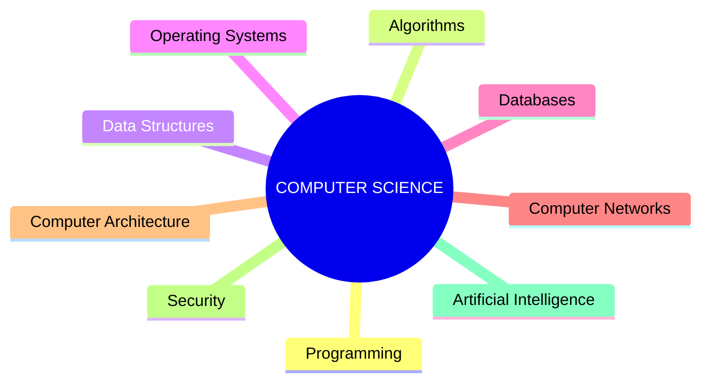
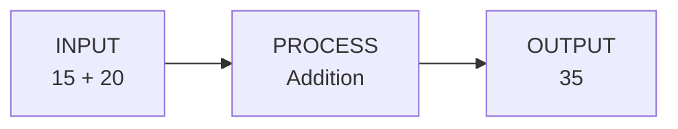
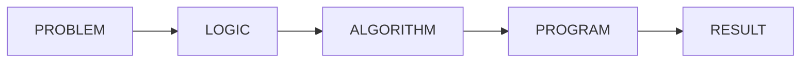
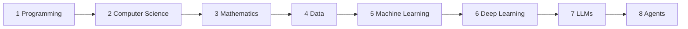

# Class 01 — Pen-Tablet / Digital Whiteboard Board Plan

**Bong Study Hub — Foundation Batch 2026**
**Class:** Welcome to Computer Science
**Source of truth:** `01_Instructor_Guide/Class_01_Master_Instructor_Guide.md` and
`02_Student_Notes/Class_01_Student_Notes.md`. This document adds *how to draw
it live* — it introduces no new academic content and no new terminology.

This is a **drawing plan**, not a script. It tells you what to put on the
tablet, in what order, in what color, and when to stop drawing and talk.
Read it once before class; keep `Class_01_Board_Quick_Reference.md` open
*during* class instead of this file.

---

## Table of Contents

0. [How to Use This Document](#0-how-to-use-this-document)
1. [Core Principle — Slide vs. Board](#1-core-principle--slide-vs-board)
2. [Interaction Cue Legend](#2-interaction-cue-legend)
3. [Color System](#3-color-system)
4. [Class Timing Overview — 90 / 110 / 120 Minutes](#4-class-timing-overview--90--110--120-minutes)
5. [Why This Is Live — Board vs. Slide Decisions](#5-why-this-is-live--board-vs-slide-decisions)
6. [The Six Live Drawings](#6-the-six-live-drawings)
   - [Drawing 1 — Computer Science Map](#drawing-1--computer-science-map)
   - [Drawing 2 — Input → Process → Output](#drawing-2--input--process--output)
   - [Drawing 3 — Problem → Logic → Algorithm → Program → Result](#drawing-3--problem--logic--algorithm--program--result)
   - [Drawing 4 — Computational Thinking](#drawing-4--computational-thinking)
   - [Drawing 5 — Traditional Programming vs. ML vs. Generative AI](#drawing-5--traditional-programming-vs-ml-vs-generative-ai)
   - [Drawing 6 — The Learning Staircase](#drawing-6--the-learning-staircase)
7. [Board Transitions — One Visual Story](#7-board-transitions--one-visual-story)
8. [Writing Rules](#8-writing-rules)
9. [Student Copying Strategy](#9-student-copying-strategy)
10. [Pen-Tablet Practice Routine (Before Class)](#10-pen-tablet-practice-routine-before-class)
11. [Recovery & Failure Scenarios](#11-recovery--failure-scenarios)
12. [Final Board State & Most Important Takeaway](#12-final-board-state--most-important-takeaway)

---

## 0. How to Use This Document

- Read Sections 1–5 once, before your first time teaching this class.
- Read Section 6 (the six drawings) carefully the night before class.
- During class, use **`Class_01_Board_Quick_Reference.md`** — this document
  is the reasoning behind that cheat sheet, not something to read live.
- Every drawing here maps to a numbered drawing in the Master Instructor
  Guide's Section 6 ("Pen-Tablet Drawing Guide"). Nothing here contradicts
  it — this document only adds stroke-by-stroke sequencing, color, and
  interaction timing.

---

## 1. Core Principle — Slide vs. Board

| | Provides |
|---|---|
| **Slide** | Structure, context, titles, major visual anchors |
| **Pen tablet (board)** | Reasoning, derivation, examples, interaction, live problem-solving, emphasis |

Rule of thumb used throughout this plan:

- If students benefit from **watching an idea get built**, it goes on the
  **board**.
- If students benefit from **a clean reference they can glance back at**,
  it goes on a **slide**.
- If both matter, the **slide is the anchor** (a title, a question, or an
  empty frame) and the **board does the reasoning** inside or beside it.

A slide during a live-drawing section should usually contain **only a
title or a question** — never a finished version of what you're about to
draw. If the answer is already on the slide, there is nothing left to
build live.

---

## 2. Interaction Cue Legend

These bracketed cues appear throughout Section 6. They are stage directions
for you, not text to say aloud.

| Cue | Meaning |
|---|---|
| `[ASK]` | Pose a question to the room. |
| `[PAUSE]` | Stop talking. Let silence sit for 3–5 seconds. |
| `[DRAW]` | Put pen to tablet — this stroke happens now, not before. |
| `[CHECK UNDERSTANDING]` | Scan the room / call one name to confirm the idea landed before moving on. |
| `[LET STUDENTS ANSWER]` | Wait for a real answer before you supply one — do not fill the silence yourself. |
| `[DO NOT EXPLAIN YET]` | Write the word/box but withhold the explanation — the gap is intentional. |
| `[CONNECT TO PREVIOUS DRAWING]` | Say the one sentence that links this board to the one before it (see Section 7). |

---

## 3. Color System

**Maximum three functional colors, used identically across all six
drawings.** Never use a color for decoration — every color change carries
meaning.

| Color | Meaning | Used for |
|---|---|---|
| **Black (or dark ink)** | Main structure | Boxes, arrows, frames, connector lines — the skeleton of every drawing |
| **Blue** | Core concept / the answer | The key term being taught right now — the word students should remember, the box currently "live" in the discussion |
| **Red** | Tension, question, or emphasis | Question marks, missing information, the moment something breaks (tea activity gaps), circling the *one* most important element on a finished drawing |

Practical rule: **draw the skeleton in black, promote a box to blue the
moment it becomes the answer to a question you just asked, and reach for
red only when you want the room's eyes to snap to one spot.** If you find
yourself using red more than twice per drawing, you are decorating, not
signaling — stop.

---

## 4. Class Timing Overview — 90 / 110 / 120 Minutes

All timestamps are minutes from class start, taken directly from the
section boundaries in the Master Instructor Guide §4 (Class Flow &
Timing). "Recommended" is the default — use it unless the slot itself is
shorter or longer than 110 minutes.

| Drawing | 90-min window | **110-min window (default)** | 120-min window |
|---|---|---|---|
| 1 — CS Map | ~6–11 min | **~9–17 min** | ~10–19 min |
| 2 — Input → Process → Output | ~25–29 min | **~33–39 min** | ~38–45 min |
| 3 — Problem → ... → Result | ~33–44 min | **~43–56 min** | ~48–62 min |
| 4 — Computational Thinking | ~47–52 min | **~59–67 min** | ~64–73 min |
| 5 — Programming vs. ML vs. GenAI | ~68–71 min | **~86–90.5 min** | ~93–98 min |
| 6 — Learning Staircase | ~71–75 min | **~90.5–95 min** | ~98–102 min |

**How the 90-minute compression works:** every *shortenable* class section
drops to its Min value (per Guide §4.3); Drawings 1, 2, 4, 5 and 6 get
drawn faster and with fewer live student examples, but every stage still
happens — you cut *pace and discussion*, never *stages*. Drawing 3 keeps
almost its full time (14 vs. 16 min) because it is protected content.

**How the 120-minute expansion works:** the extra time (per Guide §4.2)
goes into Sections 2, 3, and 6 of the class — meaning Drawings 1, 4, 5, and
6 get more breathing room and more student-sourced examples per box, not
new boxes. Do not add a seventh drawing or extra detail inside any box to
fill the extra time.

---

## 5. Why This Is Live — Board vs. Slide Decisions

| Concept | Decision | Why |
|---|---|---|
| Opening question ("What is Computer Science?") | **BOTH** | Slide holds just the question as an anchor; board (or visible note) collects the words students actually say, live — those words feed Drawing 1. |
| Computer Science map | **LIVE BOARD** | The map must visibly grow out of students' own answers — a finished slide would remove the "you were all partly right" moment. |
| "What happens when we use technology" (Like-button trace) | **SLIDE** (optional, not one of the six drawings) | It's a one-time hook, not a concept students need to reconstruct or retain — a quick slide list is enough; skip entirely under time pressure. |
| Computer / Program / Application definitions | **SLIDE** | These are vocabulary, not reasoning — a clean reference the students glance at is more useful than watching you write three definitions. |
| Input → Process → Output | **LIVE BOARD** | The arrow *is* the causal idea being taught; watching input flow into output in real time is the lesson. |
| Problem → Logic → Algorithm → Program → Result | **LIVE BOARD** | The single most important idea in the class — must be built one link at a time, driven by student answers, not presented finished. |
| "Larger of two numbers" algorithm | **LIVE BOARD** (inside Drawing 3) | Students supply the steps; the algorithm must visibly come from their reasoning, not from you. |
| Algorithm vs. Program comparison | **SLIDE** (reference) **+ brief board note** | The three-row comparison is a stable reference table (already in Student Notes) — reproduce only a two-word note ("recipe / dish") on the board next to Drawing 3, don't rebuild the whole table live. |
| Computational thinking (4 quadrants) | **LIVE BOARD** | Each quadrant should fill in only once *its* example is discussed — a finished 2×2 slide invites students to read ahead instead of think. |
| Tea activity ("teach a computer to make tea") | **LIVE BOARD** (student-driven, not a diagram) | This is spoken interaction, not a diagram — the "board" here is optional short notes tracking assumptions students missed; the point is the live failure, not a drawing. |
| Traditional Programming vs. ML vs. GenAI | **LIVE BOARD** | The shift in what sits on the *left* of the arrow (rules → data → prompt) needs to be watched happening, row by row. |
| Learning staircase | **LIVE BOARD** | The physical metaphor ("we build the staircase") only lands if students watch it get built step by step, not glance at a finished infographic. |
| Four-month roadmap | **SLIDE** | This is reference information (what happens in Month 1–4) — a clean table is more useful than hand-drawing four boxes; save board time for the six core drawings. |
| Recap questions | **SLIDE** (questions only, no answers) | The slide holds the five questions as prompts; answers live in discussion, never written up as a "model answer" on the board. |

---

## 6. The Six Live Drawings

### Drawing 1 — Computer Science Map

#### 1. Purpose
A slide showing "Programming, Algorithms, Data Structures, OS, Databases,
Networks, Architecture, Security, AI" feels like a list to memorize.
Watching the same map *grow out of the words students just said* turns it
into proof that their answers were right — just incomplete. That's the
whole emotional point of "CS ≠ Coding."

#### 2. Timing
- **110 min (default):** ~9–17 min mark (~8 min), inside Section 2 (What
  is Computer Science?).
- 90 min: ~6–11 min (~5 min, fewer satellite fields drawn from scratch).
- 120 min: ~10–19 min (~9 min, more time spent naming where each student's
  earlier answer landed).

#### 3. Slide state before drawing
Only the title **"Computer Science"** inside a plain circle. Nothing else
— no list of subfields, no arrows.

#### 4. Final board state

(On the physical board this renders as one central circle with 9 small
boxes around it, each joined to the center by a single line — see Stage 3
below.)

#### 5. Drawing sequence
- **Stage 1 — [DRAW]** Draw the central circle/box, write **COMPUTER
  SCIENCE** inside it in black. This should already roughly match the
  slide's circle so the transition from slide to board feels seamless.
- **Stage 2 — [ASK] [LET STUDENTS ANSWER]** "A few of you already said
  coding, AI, software when I asked earlier — let's place those first."
  For each word a student offered: draw one satellite box, connect it to
  the center with a short line, write the field name in **blue**.
- **Stage 3 — [DRAW]** Add 2–3 fields nobody mentioned (e.g., Computer
  Networks, Security) in **black** — this is what proves the map is bigger
  than their answers.
- **Stage 4 — [DRAW]** Fill remaining fields (Data Structures, Operating
  Systems, Databases, Computer Architecture) in black until all 9 are
  present.
- **Stage 5 — [ASK] [CHECK UNDERSTANDING]** Point at one satellite box and
  ask which field it is / whether it's "coding." Circle **Programming** in
  **red** briefly to make the point "coding is one box out of nine," then
  return the pen to black.

#### 6. Instructor narration
- Open by literally repeating 2–3 words students said in the opening
  question — that repetition is what makes the reveal work.
- Frame every added box as "you were right, here's where that lives" —
  never as "you were wrong."
- Close with the CS ⊃ programming point stated once, plainly.

#### 7. Student interaction
- `[ASK]` "What did we say Computer Science was, a few minutes ago?"
  `[LET STUDENTS ANSWER]` before drawing Stage 2.
- `[ASK]` "Which of these have you touched without realizing it was
  Computer Science?" — pause after Stage 4, before Stage 5.
- `[CHECK UNDERSTANDING]` after Stage 5: "So is coding all of Computer
  Science, or one part of it?"

#### 8. Student notes
**Copy required.** Tell students explicitly: "copy the center circle and
all nine boxes, roughly positioned — you don't need it to look neat."

#### 9. Color strategy
- Black: center circle, all connecting lines, most satellite boxes.
- Blue: satellite boxes that came directly from a student's own answer.
- Red: the one-second circle around "Programming" in Stage 5, then reset.

#### 10. What NOT to draw
- Do not expand any satellite into sub-topics (e.g., don't break
  "Algorithms" into sorting/searching/graphs) — that's a future class.
- Do not draw more than 9–10 satellite boxes; resist adding every field a
  student can name.

#### 11. Recovery strategy
If students are still copying when you're ready to move to Drawing 2 or
Section 3: say **"Stop writing — take a photo of this one at the break,
I'll leave it on screen."** Do not re-draw it later; leave the finished
map visible in a corner of the screen (minimized, not erased) through
Section 3, since Drawing 1 has no further edits coming.

---

### Drawing 2 — Input → Process → Output

#### 1. Purpose
The arrow direction *is* the idea: information flows one way, gets
transformed, and comes out the other side. Watching "15 + 20" travel
left-to-right into "35" makes the causality visible in a way a static
three-box slide does not.

#### 2. Timing
- **110 min (default):** ~33–39 min mark (~6 min), start of Section 4.
- 90 min: ~25–29 min (~4 min, one worked example only, no second example).
- 120 min: ~38–45 min (~7 min, room for both the calculator and
  face-unlock examples fully drawn).

#### 3. Slide state before drawing
Nothing, or just the section title "How Computers Solve Problems." No
boxes, no arrows.

#### 4. Final board state


#### 5. Drawing sequence
- **Stage 1 — [DRAW]** Draw three empty boxes left to right, connected by
  two arrows, in **black**. Leave them unlabeled for a beat.
- **Stage 2 — [ASK] [DO NOT EXPLAIN YET]** "If I type 15 + 20 into a
  calculator, where does that number go — which box?" `[LET STUDENTS
  ANSWER]`
- **Stage 3 — [DRAW]** Write "15 + 20" in the first box in **blue**.
- **Stage 4 — [DRAW]** Write "Addition" in the middle box in black —
  narrate that this box is what the *computer does*, not what the user
  sees.
- **Stage 5 — [DRAW]** Write "35" in the last box in **blue** as you trace
  the arrow with the pen tip from box 2 to box 3.
- **Stage 6 — [ASK]** Face-unlock follow-up question (see below); if
  time allows, briefly relabel the same three boxes for that example
  rather than drawing a second chain.

#### 6. Instructor narration
- Say the three words — input, process, output — *as you draw each box*,
  not before.
- Name the middle box as a "black box for today" — explicitly say we are
  not opening it yet.
- Explicitly flag the caveat: real systems are more complex than three
  boxes; this is a starting mental model.

#### 7. Student interaction
- `[ASK]` "What's the input and output when you unlock your phone with
  your face?" `[PAUSE]` `[LET STUDENTS ANSWER]`
- `[CHECK UNDERSTANDING]` "What do you think is happening inside
  'Process'?" — accept a shrug; this is meant to stay a mystery today.

#### 8. Student notes
**Copy required.** The three-box skeleton with the calculator example
filled in. The face-unlock example is optional to copy — mention it's
already in their Student Notes handout.

#### 9. Color strategy
- Black: the three boxes, the two arrows, the word "Addition."
- Blue: the input value and the output value — the two things that
  actually change between examples.
- Red: not needed for this drawing.

#### 10. What NOT to draw
- Do not open the "Process" box to show internal steps (no flowchart
  inside it) — it stays a black box on purpose.
- Do not draw a second full three-box chain for the face-unlock example;
  relabel the existing one.

#### 11. Recovery strategy
If students are behind: this drawing is short and low-risk — simply pause
2–3 extra seconds after Stage 5 rather than skipping ahead. If truly
pressed for time, skip Stage 6 (the follow-up example) entirely; the core
diagram (Stages 1–5) is what must be copied.

---

### Drawing 3 — Problem → Logic → Algorithm → Program → Result

#### 1. Purpose
This is the single most important diagram in the class. It is not a label
for five words — it's the *thinking process* that turns a messy real-world
problem into a working solution, and every later class in the program
refers back to it. It must be built by asking "what comes next," never
presented finished.

#### 2. Timing
- **110 min (default):** ~43–56 min mark (~13 min), start of Section 5.
  This section is protected — never compress it below the Min in Guide
  §4.1.
- 90 min: ~33–44 min (~11 min — same stages, faster pacing only).
- 120 min: ~48–62 min (~14 min — same stages, more room for the worked
  example and optional Stage 9 below).

#### 3. Slide state before drawing
Nothing. No boxes, no words — this is the one drawing that most benefits
from a completely blank canvas.

#### 4. Final board state

With the worked example noted under Problem and Algorithm:
```
PROBLEM: "find the larger of two numbers (A=15, B=21)"
ALGORITHM:
  1. Take two numbers.
  2. Compare them.
  3. If A > B, A is larger.
  4. Otherwise, B is larger.
```

#### 5. Drawing sequence
This drawing must follow the progressive-reveal pattern exactly — one box
at a time, each one earned by a question, never the full chain shown
before it's built.

- **Stage 1 — [DRAW]** Write **PROBLEM** alone on the far left, in black,
  with plenty of empty space to its right. `[ASK]` "Everything starts
  with a real problem. Give me one — anything." `[LET STUDENTS ANSWER]`
  Use (or redirect to) "find the larger of two numbers, A = 15, B = 21."
- **Stage 2 — [ASK] [PAUSE]** "Before I touch a computer, what's the very
  first thing I have to do?" `[LET STUDENTS ANSWER]` Land on "think about
  it" / "figure out how."
- **Stage 3 — [DRAW]** Add an arrow and **LOGIC** in black. Narrate: no
  computer exists yet at this box — it's pure thinking.
- **Stage 4 — [ASK]** "Now I've thought it through in my head. What do I
  need to do to make that thinking usable — so someone *else* could follow
  it?" `[LET STUDENTS ANSWER]` Land on "write the steps down."
- **Stage 5 — [DRAW]** Add an arrow and **ALGORITHM** in **blue** (this
  box is the answer to today's core question — promote it). Immediately
  underneath, build the actual algorithm live using the class's numbers:
  `[DRAW]` steps 1–4 one at a time, `[ASK]` after each step whether it's
  enough yet, until the class lands on the 4-step algorithm from the
  Guide.
- **Stage 6 — [ASK]** "This is still just words on a board. What has to
  happen before a computer can actually do this?" `[LET STUDENTS ANSWER]`
  Land on "translate it into a language the computer understands."
- **Stage 7 — [DRAW]** Add an arrow and **PROGRAM** in black. Write only a
  language-agnostic tag under it — "(Python / C / etc.)" — never real
  syntax.
- **Stage 8 — [DRAW]** Add the final arrow and **RESULT** in **blue**.
  Narrate: "Run the program on A = 15, B = 21 — what comes out?" `[LET
  STUDENTS ANSWER]` → "21."
- **Stage 9 (optional, time-permitting) — [DRAW]** Below the chain, jot a
  two-word note under ALGORITHM and PROGRAM: "recipe" / "dish" — this is
  the only board trace of the Algorithm≠Program comparison; the full
  three-row table stays on the slide / in Student Notes, not rebuilt live.

#### 6. Instructor narration
- Never say the next word before asking what it should be — the room
  should feel like it is deriving the chain, not receiving it.
- Hold a visible pause (2–3 seconds) after each `[ASK]` before drawing the
  next box — this is the single drawing where rushing does the most
  damage.
- Explicitly tell students this diagram will return "constantly" for the
  rest of the four months — that's not exaggeration, say it plainly.

#### 7. Student interaction
- `[ASK]` at every stage transition (Stages 1, 2, 4, 6, 8) as listed
  above — this drawing is built almost entirely from student answers.
- `[CHECK UNDERSTANDING]` after Stage 8: "Could two different languages
  both implement this same algorithm? What would stay the same?"

#### 8. Student notes
**Copy required — the most important copy instruction of the whole
class.** Say explicitly: "This one goes in your notes. We'll refer back to
it all program — get the five boxes and the arrows, the worked example
underneath is a bonus if you have time."

#### 9. Color strategy
- Black: PROBLEM, LOGIC, PROGRAM boxes, all arrows, the worked-example
  algorithm steps.
- Blue: ALGORITHM and RESULT — the two boxes that are today's actual
  payoff (turning thinking into steps, and getting an answer out).
- Red: none needed. If a student proposes an incorrect step while building
  the algorithm, circle it briefly in red, ask "does this always work?",
  then erase and correct in black — don't leave red marks standing.

#### 10. What NOT to draw
- No real program code or syntax inside the PROGRAM box.
- No sixth box, no branching arrows, no "what if" side-paths hanging off
  the main chain — keep it a single straight line of five boxes.

#### 11. Recovery strategy
This drawing cannot be rushed, so protect its time upstream instead of
downstream: if you're running late entering Section 5, borrow the missing
minutes from Section 2, 3, or 6 (all marked "Shortenable" in Guide §4.1),
never from this one. If students are still copying when the worked example
finishes, say **"Leave the algorithm steps for later — get the five boxes
and arrows down now, that's the part you can't miss."**

---

### Drawing 4 — Computational Thinking

#### 1. Purpose
Four separate ideas (decomposition, pattern recognition, abstraction,
algorithmic thinking) blur into one paragraph if explained in a row. A 2×2
grid filled in one quadrant at a time keeps them visually distinct and
lets each one get its own brief example before the next appears.

#### 2. Timing
- **110 min (default):** ~59–67 min mark (~8 min), start of Section 6.
- 90 min: ~47–52 min (~5 min — one instructor example per quadrant, skip
  asking students for their own).
- 120 min: ~64–73 min (~9 min — ask students for their own example on at
  least two quadrants).

#### 3. Slide state before drawing
An empty 2×2 grid outline only — four blank rectangles, no labels, no
text. This is the one drawing where the *frame* is pre-drawn on the slide
(structure is not the point; the content is).

#### 4. Final board state
```
┌───────────────────────────┬───────────────────────────┐
│ DECOMPOSITION             │ PATTERN RECOGNITION       │
│ e.g. planning a party →   │ e.g. comparing numbers =  │
│ invitations, food, venue  │ comparing heights         │
├───────────────────────────┼───────────────────────────┤
│ ABSTRACTION               │ ALGORITHMIC THINKING      │
│ e.g. driving a car →      │ e.g. "larger of two       │
│ "accelerator = go"        │ numbers" (→ Drawing 3)    │
└───────────────────────────┴───────────────────────────┘
```

#### 5. Drawing sequence
- **Stage 1 — [DRAW]** On the pre-drawn slide grid (or a freshly drawn
  2×2 grid if working on a blank board), write **DECOMPOSITION** in
  **blue** in the top-left cell. `[ASK]` "If I asked you to plan a
  birthday party, would you do it as one giant task or break it into
  pieces?" `[LET STUDENTS ANSWER]`
- **Stage 2 — [DRAW]** Add the one-line example underneath in black:
  "planning a party → invitations, food, venue, guest list."
- **Stage 3 — [DRAW]** Write **PATTERN RECOGNITION** in blue, top-right
  cell. `[ASK]` "What's similar between comparing two numbers and
  comparing two people's height?" `[LET STUDENTS ANSWER]` then add the
  example line.
- **Stage 4 — [DRAW]** Write **ABSTRACTION** in blue, bottom-left cell.
  Add the driving-a-car example, narrating "accelerator = go" as the one
  thing that matters, ignoring the engine underneath.
- **Stage 5 — [DRAW] [CONNECT TO PREVIOUS DRAWING]** Write **ALGORITHMIC
  THINKING** in blue, bottom-right cell. Point back at Drawing 3 (still
  visible or referenced) and say "you already did this one, twenty
  minutes ago."

#### 6. Instructor narration
- Introduce each quadrant with a question before naming it — don't lead
  with the vocabulary word.
- Keep every example to one line; resist the urge to add a second example
  per quadrant even if a good one comes up — redirect it to discussion
  instead of the board.
- Land the close on "you used all four of these today without realizing
  it" — this is the emotional payoff of the drawing.

#### 7. Student interaction
- One `[ASK]` per quadrant (Stages 1, 3, 4) as above.
- `[CHECK UNDERSTANDING]` after Stage 5: pick one quadrant and ask a
  student to give a *different* example than the one on the board.

#### 8. Student notes
**Copy required.** All four quadrants with their one-line examples — tell
students the formal definitions are not needed, the word + example pair
is enough.

#### 9. Color strategy
- Black: the grid lines, all example text.
- Blue: the four quadrant title words only — these are the vocabulary
  being taught.
- Red: not needed.

#### 10. What NOT to draw
- No formal definitions written out — one word plus one example per
  quadrant is the ceiling for today.
- No fifth quadrant, no sub-bullets inside a quadrant.

#### 11. Recovery strategy
If students are still copying quadrant 1–2 while you want to move to
quadrant 3: say **"Keep copying — I'll talk through this one out loud, you
can catch up on the writing after class using your Student Notes."** All
four quadrants already exist verbatim in the Student Notes handout, so
falling behind here is low-risk — say that explicitly to reduce anxiety.

---

### Drawing 5 — Traditional Programming vs. Machine Learning vs. Generative AI

#### 1. Purpose
The point is not the three individual chains — it's the *shift* visible
when you stack them: what sits on the left of the arrow changes from
"rules a human wrote" to "data" to "a prompt." That shift is only visible
if the three rows are drawn one under the other, in the same style, in
real time.

#### 2. Timing
- **110 min (default):** ~86–90.5 min mark (~4.5 min), start of Section 8.
- 90 min: ~68–71 min (~3 min — draw all three rows but skip the
  "point out row 1" callback).
- 120 min: ~93–98 min (~5 min — same three rows, slower pacing).

#### 3. Slide state before drawing
Nothing. No rows, no boxes.

#### 4. Final board state
```
Traditional Programming:   INPUT   →  RULES     →  OUTPUT
Machine Learning:          DATA    →  LEARNING  →  MODEL  →  PREDICTION
Generative AI:              PROMPT →  LLM       →  GENERATED RESPONSE
```

#### 5. Drawing sequence
- **Stage 1 — [DRAW]** Write "Traditional Programming:" as a row label in
  black, then draw the three-box chain `INPUT → RULES → OUTPUT` using the
  exact same box style as Drawing 2. `[CONNECT TO PREVIOUS DRAWING]` "This
  is the same three boxes from earlier — just relabeled."
- **Stage 2 — [DRAW]** Directly underneath, write "Machine Learning:" and
  draw `DATA → LEARNING → MODEL → PREDICTION`. Put **DATA** in **blue** —
  narrate that this is the box that changed from row 1.
- **Stage 3 — [DRAW]** Underneath that, write "Generative AI:" and draw
  `PROMPT → LLM → GENERATED RESPONSE`. Put **PROMPT** in **blue** for the
  same reason.
- **Stage 4 — [ASK]** "Look at the left-most box in each row. What
  changed, row by row?" `[LET STUDENTS ANSWER]` — this is the entire
  point of the drawing.

#### 6. Instructor narration
- State plainly, once per row: who/what is writing the rules (human →
  learned from data → the model responds to a prompt).
- Explicitly say "we are not learning how any of these work yet" before
  or after drawing — prevents students from expecting architecture detail.
- Do not let this become a definitions lecture — three short sentences,
  then move to the question in Stage 4.

#### 7. Student interaction
- `[ASK]` in Stage 4 is the main interaction point.
- `[CHECK UNDERSTANDING]` optional: "Which pipeline uses a prompt?"

#### 8. Student notes
**Copy required.** All three rows, in the same box style as Drawing 2 for
visual consistency with their notes.

#### 9. Color strategy
- Black: all box outlines, arrows, and row labels.
- Blue: the left-most box in rows 2 and 3 (DATA, PROMPT) — the two boxes
  that demonstrate the shift being taught.
- Red: not needed.

#### 10. What NOT to draw
- No neural network diagrams, no model architecture, no training loop —
  none of that is in scope today.
- Do not add a fourth row (e.g., "AI Agents") — that belongs to Drawing 6
  and Month 3, not here.

#### 11. Recovery strategy
This is a fast drawing; if the room is behind from Drawing 4 or the tea
activity, it's acceptable to draw all three rows without pausing for
Stage 4's question and instead ask it verbally while students finish
copying — the visual shift is still visible even mid-copy.

---

### Drawing 6 — The Learning Staircase

#### 1. Purpose
"We build the staircase, we don't jump to the top" is a physical metaphor
— it only works if students watch actual ascending steps appear one at a
time, ending on the step they're standing on today (Programming / CS).

#### 2. Timing
- **110 min (default):** ~90.5–95 min mark (~4.5 min), immediately after
  Drawing 5, still in Section 8.
- 90 min: ~71–75 min (~4 min — draw the full staircase, skip circling the
  first two steps individually, just underline both at once).
- 120 min: ~98–102 min (~4–5 min — same steps, more discussion per step
  if questions come up).

#### 3. Slide state before drawing
Nothing.

#### 4. Final board state
```
                                                 ┌───┐
                                          ┌───┐  │ 8 │
                                    ┌───┐ │ 7 │  │   │
                              ┌───┐ │ 6 │ │   │  │   │
                        ┌───┐ │ 5 │ │   │ │   │  │   │
                  ┌───┐ │ 4 │ │   │ │   │ │   │  │   │
            ┌───┐ │ 3 │ │   │ │   │ │   │ │   │  │   │
      ┌───┐ │ 2 │ │   │ │   │ │   │ │   │ │   │  │   │
      │ 1 │ │   │ │   │ │   │ │   │ │   │ │   │  │   │
      └───┘ └───┘ └───┘ └───┘ └───┘ └───┘ └───┘  └───┘
```
Plain ascending rectangles, each one step taller than the last, numbered
1–8 left to right — nothing more. Labels are written below the staircase
as a simple numbered line, not squeezed into the boxes:



#### 5. Drawing sequence
- **Stage 1 — [DRAW]** Draw 8 small rectangles in a row, each one taller
  than the last (a staircase silhouette), in **black**. Leave them
  unlabeled.
- **Stage 2 — [DRAW]** Number them 1–8 left to right as you draw, or
  immediately after — small numbers inside each step. The boxes are too
  narrow for full words, so labels go *underneath* the staircase, not
  inside the steps.
- **Stage 3 — [DRAW]** Below steps 1–2, write in **blue**: "1 Programming",
  "2 Computer Science." `[CONNECT TO PREVIOUS DRAWING]` "These two are
  where we are, right now, today."
- **Stage 4 — [DRAW]** Below steps 3–5, write in black: "3 Mathematics",
  "4 Data", "5 Machine Learning."
- **Stage 5 — [DRAW]** Below steps 6–8, write in black: "6 Deep Learning",
  "7 LLMs", "8 Agents."
- **Stage 6 — [DRAW]** Circle steps 1 and 2 together in **red** —
  "starting here, today."

#### 6. Instructor narration
- Say each label as you write it, moving left to right, without jumping
  ahead — the ascending order *is* the argument.
- Close with the key line once, plainly: "We are not jumping straight to
  AI. We are building the staircase, one step at a time."

#### 7. Student interaction
- `[CHECK UNDERSTANDING]` after Stage 6: "Which step are we circling, and
  why those two?"
- No `[ASK]`-driven construction here — unlike Drawings 3 and 4, this
  staircase is told, not derived, because it's a roadmap statement, not a
  reasoning chain. Keep the pace brisk.

#### 8. Student notes
**Copy required.** The staircase with all eight labels — tell students the
exact shape doesn't matter, the order and the circle around steps 1–2 do.

#### 9. Color strategy
- Black: all eight step rectangles, numbers, and 6 of the 8 labels.
- Blue: labels for steps 1–2 (Programming, Computer Science) — today's
  actual position.
- Red: the circle around steps 1–2 in Stage 6 — the single emphasis mark
  of the whole drawing.

#### 10. What NOT to draw
- No timelines, month numbers, or course names on this diagram — the
  four-month roadmap is a separate (slide) visual and should not be
  merged in.
- No sub-branches off any step (e.g., don't split "Machine Learning" into
  supervised/unsupervised) — that's a future class.

#### 11. Recovery strategy
This is the last drawing of the class and the least time-flexible
downstream (recap follows immediately) — if students are still copying,
say **"This one's short and it's in your Student Notes exactly as drawn —
finish the sentence I'm saying, then copy after."** Do not delay the
roadmap section (Section 9) to let copying finish; the staircase and the
spoken roadmap are intentionally back-to-back and reinforce each other
even if note-taking lags slightly.

---

## 7. Board Transitions — One Visual Story

Say the bridging sentence out loud every time you move from one drawing
(or major concept) to the next — this is what keeps six separate drawings
feeling like one continuous idea instead of six unrelated diagrams.

```
Drawing 1 (CS Map)
   "Now that we've mapped the field, let's zoom into one question:
    how does a computer actually solve something?"
        ↓
Drawing 2 (Input → Process → Output)
   "That 'Process' box was a mystery box. Giving a computer instructions
    to fill it in is called programming — and it starts with a bigger
    chain than three boxes."
        ↓
Drawing 3 (Problem → Logic → Algorithm → Program → Result)
   "Before you can turn a problem into an algorithm, you need a certain
    way of thinking. Let's name what you just did."
        ↓
Drawing 4 (Computational Thinking)
   "Algorithmic thinking is exactly what you're about to try, live —
    on me."
        ↓
   [Tea activity — spoken, not a diagram]
   "That gap between what you meant and what you actually said is
    exactly what separates how we've been programming from something
    newer."
        ↓
Drawing 5 (Traditional Programming vs. ML vs. GenAI)
   "If Machine Learning and Generative AI are newer branches, where do
    they come from? Let's build the whole staircase."
        ↓
Drawing 6 (Learning Staircase)
```

---

## 8. Writing Rules

Practical rules for legibility on a shared screen, not artistic advice.

- **Headings** (box titles, section words like "COMPUTER SCIENCE",
  "PROBLEM"): large, bold strokes — roughly 3× the visual weight/size of
  body text. If your software reports point sizes, aim for the
  equivalent of ~40–48pt.
- **Body text** (examples, sub-labels): medium weight, clearly smaller
  than headings — roughly the equivalent of ~22–26pt. Never smaller than
  that; a student on a phone screen-share must still read it.
- **Maximum 3–4 words per box.** If a label needs a sentence, it belongs
  in the Student Notes, not on the board.
- **Maximum 8–9 boxes per drawing** (Drawing 1's map is the ceiling case
  at 9 satellites + 1 center). Beyond that, split the idea across two
  drawings rather than cramming one.
- **Leave visible empty space around every drawing** — at least one
  box-width of margin on all sides. A board that touches the edges of the
  screen reads as cluttered even if the content is simple.
- **Erase when:** a drawing is fully superseded by the next one and has
  already been given its "stop writing, take a photo" moment (see each
  drawing's Recovery strategy) — or when a mistake needs correcting
  (Section 11).
- **Do not erase when:** a diagram is referenced by a later drawing
  (Drawings 3 and 6 are referenced again near the end of class) — keep it
  visible in a minimized corner instead of deleting it.
- **Avoid clutter** by finishing one drawing's color logic before starting
  the next — never leave a previous drawing's red emphasis mark on screen
  once its moment has passed; reset it to black or erase that single mark.

---

## 9. Student Copying Strategy

Students should never spend the whole class transcribing the board. Every
drawing is classified below, matching exactly what the Master Instructor
Guide and Student Notes already expect students to retain.

| Drawing | Classification | Why |
|---|---|---|
| 1 — CS Map | **COPY REQUIRED** | Appears in Student Notes §1; establishes CS ⊃ programming, referenced conceptually all program. |
| 2 — Input → Process → Output | **COPY REQUIRED** | Appears in Student Notes §2; a recurring mental model. |
| 3 — Problem → ... → Result | **COPY REQUIRED (highest priority)** | Appears in Student Notes §3; explicitly the most-referenced diagram in the entire four-month program. |
| 4 — Computational Thinking | **COPY REQUIRED** | Appears in Student Notes §5; four terms used again in later classes. |
| 5 — Traditional/ML/GenAI | **COPY REQUIRED** | Appears in Student Notes §7; sets up the AI bridge. |
| 6 — Learning Staircase | **COPY REQUIRED** | Appears in Student Notes §7; sets up the roadmap. |
| "Like-button" trace (optional hook, not a numbered drawing) | **DO NOT COPY** | Not in Student Notes; a one-time motivational hook only — say so explicitly if you draw it at all. |
| Tea activity notes (assumptions tracked live, if any) | **DO NOT COPY** | The activity is the lesson; nothing written during it is a reference diagram. |
| Algorithm ≠ Program comparison table | **COPY OPTIONAL** | Full table already printed in Student Notes §4 — the board only shows a two-word note (Stage 9 of Drawing 3); tell students the full table is already in their handout. |
| Four-month roadmap (slide, not board) | **COPY OPTIONAL** | Already printed in Student Notes §8 as a table. |

**When to say "stop writing and look at the board":**
- At the *start* of every `[ASK]`-driven stage inside Drawings 1, 3, and 4
  — the question-and-answer moment is the point, and pens should be down
  for it.
- Whenever you are about to erase, correct a mistake, or reveal the answer
  to a question you just posed.

**When students can copy:**
- Immediately after a box is finalized and colored (not while you're
  still writing it) — give a visible 3–5 second pause after finishing each
  stage before speaking again.
- During the two `[SLIDE]`-only concept blocks (Computer/Program/
  Application definitions; the four-month roadmap) — these are calm,
  finished references with no live construction to watch.

---

## 10. Pen-Tablet Practice Routine (Before Class)

**Total time: ~25 minutes.** Do this once before teaching Class 1 for the
first time, and skim it again before each new cohort. The goal is muscle
memory, not artistic skill.

| Order | Drill | Time | What to practice |
|---|---|---|---|
| 1 | Straight arrows | 2 min | Left-to-right and top-to-bottom arrows, consistent arrowhead size, without lifting the pen mid-stroke. |
| 2 | Rectangles | 2 min | Quick, slightly imperfect rounded rectangles at a consistent size — speed over precision. |
| 3 | Circles | 2 min | Ovals for the CS map's center and satellites — again, speed over precision. |
| 4 | Large headings | 2 min | Write "COMPUTER SCIENCE", "PROBLEM", "ALGORITHM" at heading size — check legibility by zooming your screen-share preview out. |
| 5 | Connecting arrows between existing shapes | 3 min | Draw 3 boxes, then connect them cleanly without redrawing the boxes — this is the core motion of Drawings 2, 3, 5. |
| 6 | Switching colors mid-drawing | 3 min | Draw a 3-box chain in black, then go back and recolor one box blue without redrawing it — this is the core motion of Drawings 3, 5, 6. |
| 7 | Erasing selectively | 3 min | Draw 4 boxes, erase only the 2nd one without disturbing the others — needed for Drawing 3's optional mistake-correction (§11.3 below). |
| 8 | Writing while speaking out loud | 3 min | Draw and label a 3-box chain while narrating it out loud at normal teaching pace — this is the hardest drill; most instructors under-practice it. |
| 9 | Full run-through of all six drawings | 5 min | One fast pass through Drawings 1–6 back to back, timing yourself against the 110-minute windows in Section 4. Don't aim for perfect — aim for "no hesitation about what comes next." |

If you only have 15 minutes, do drills 5, 6, 8, and 9 — those four cover
the actual motions used in every one of the six drawings.

---

## 11. Recovery & Failure Scenarios

Practical responses, not theory.

1. **Students cannot read the handwriting.**
   Increase stroke thickness and heading size immediately (see Section 8)
   rather than re-writing the same word smaller-but-neater. If it's still
   unreadable, say the word out loud and point — students can copy from
   their Student Notes handout instead of the board for that one label.

2. **Students are copying too slowly.**
   Use the per-drawing Recovery strategy in Section 6 first (each one is
   tuned to that drawing's importance). As a general rule: the more a
   drawing is marked "COPY REQUIRED (highest priority)" in Section 9
   (Drawing 3), the more you slow down for it; for everything else, keep
   moving and remind students it's already in their Student Notes.

3. **The instructor makes a drawing mistake.**
   Don't erase and restart the whole drawing. Circle the mistake briefly
   in red, say "let's fix this," erase only that element, and redraw it in
   the correct color. A visible, casually-corrected mistake is not a
   credibility problem — it models exactly the "computers need precision,
   humans iterate" idea from the tea activity.

4. **The tablet disconnects.**
   Have the six final board states (Section 6, subsection 4 of each
   drawing) saved as a one-page backup image or printed sheet. If
   reconnection takes more than ~60 seconds, talk through the current
   drawing verbally using the backup as your own reference, and switch to
   "describe it, students read it from Student Notes" mode for that one
   drawing only.

5. **The instructor accidentally erases something needed later.**
   Drawings 3 and 6 are referenced again later in class (see Section 8,
   "Do not erase when"). If either is accidentally erased, redraw only
   the skeleton (boxes + arrows, black) from memory — the exact color
   sequence doesn't need to be reproduced, only the shape and labels.

6. **The class is running 10 minutes late.**
   Switch immediately to the 90-minute compressed windows (Section 4).
   Do not improvise cuts — the compression strategy already tells you
   exactly which stages get faster (never fewer) and which section is
   protected (Section 5 / Drawing 3). Cut the optional ATM activity and
   the Like-button slide first, per Guide §4.3.

7. **The class is unusually advanced.**
   Do not add new diagrams or deeper content. Instead, spend the freed-up
   `[ASK]` pauses letting more students answer per question, and use the
   Challenge-level questions already listed in Guide §9 (Differentiated
   Questions) verbally — the board plan itself does not change.

8. **The class is unusually weak (many first-time programmers, low
   confidence).**
   Slow down Drawings 3 and 4 specifically (the two most concept-dense
   boards) by adding one extra `[PAUSE]` and one extra Foundation-level
   question from Guide §9 before advancing each stage. Do not simplify the
   diagrams themselves — the five-box and four-quadrant shapes stay
   exactly as specified; only the pacing changes.

---

## 12. Final Board State & Most Important Takeaway

**Diagrams to leave available for reference at the end of class:**
Drawing 3 (Problem → Logic → Algorithm → Program → Result) and Drawing 6
(the Learning Staircase) should still be visible or one click away when
you reach the Recap (Guide §11) — both are directly asked about in the
five recap questions ("difference between algorithm and program," "where
does this connect to AI").

**Most important single diagram of the class: Drawing 3 — Problem → Logic
→ Algorithm → Program → Result.**

Why this one, specifically:
- It is the only drawing explicitly protected from time compression in
  the Master Instructor Guide (§4.1, marked "No — core concept").
- It is the drawing the Guide itself calls "the single most important
  diagram in the class" (§6, Drawing 3).
- Three of the seven Class Success Criteria (Guide §10) map directly onto
  it: explaining what an algorithm is, distinguishing algorithm from
  program, and creating a simple everyday algorithm.
- It is the diagram every later month of the program refers back to —
  DSA, C, SQL, and even the AI/ML pipelines in Drawing 5 are all
  specific cases of "problem → structured thinking → executable form →
  result."

If only one drawing survives a badly compressed class, it must be this
one.

---

*This board plan was built from, and must remain consistent with,
`Class_01_Master_Instructor_Guide.md` and `Class_01_Student_Notes.md`. If
either source document changes, re-check every timestamp in Section 4 and
every "Copy required" classification in Section 9 before teaching from
this plan again.*
